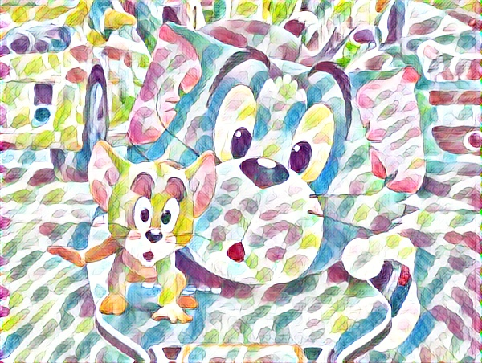
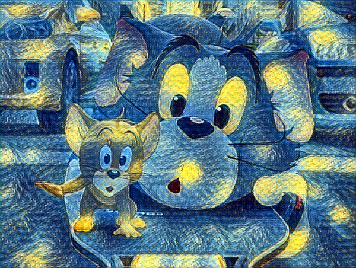
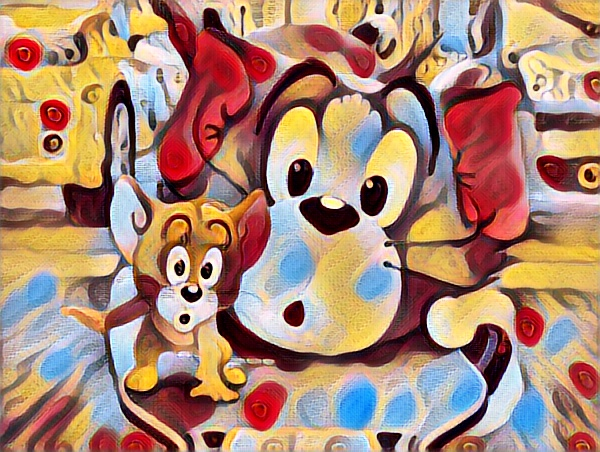

# Neural_Style_Transfer_OpenCV
Apply Neural Style Transfer on an image using OpenCV. Here 8 different pre trained models were taken and the input was passed. Some preprocessing was done and the final output the stylized image in the chosen style.

Some of the stylized images are :

Udnie :

Starry Night :

Candy :

